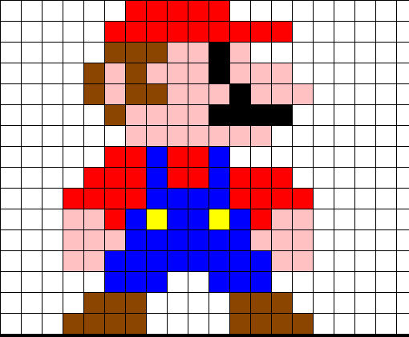
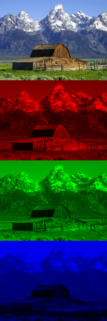

## Introducción

En esta primera parte vamos a charlar sobre algunas características que, más adelante, nos van a permitir estudiar los métodos ligados al procesamiento de una imagen.

En la segunda parte vamos a ver cómo podemos empezar a trabajar con imágenes utilizando python.

## Características de una imagen

### Los ladrillos

Podemos ver a una imagen como un conjunto de píxeles. ¿Qué es un píxel? Bueno, en principio, esas cajitas de colores que aparecen cuando hacemos mucho zoom. Cuando la imagen es un poco más grande y para verla bien nos tenemos que alejar puede que los perdamos de vista pero siguen estando ahí.

Podemos ampliar la definición agregando que un píxel mantiene un mismo color en toda su extensión.

Nuestro amigo Super Mario nos puede dar, hablando de esto, una mejor imagen:

Siendo un poco más detallistas, podemos decir que -en general- un píxel es un cuadrado(el mínimo que una imagen puede contener) que tiene un color y este viene dado por un número entero positivo. Dependiendo del campo y de la aplicación, esto no siempre es así pero nos sirve para empezar a pensar.

Dijimos que un píxel es un cuadrado. Esto quiere decir que lo podemos medir con una regla, un píxel tiene asociada una longitud en el "mundo real". Para ciertas aplicaciones esto es un detalle mucho pero muy importante.

### Bit-depth(o profundidad de color)

Hablemos ahora del color de un píxel. Dijimos que es un número entero positivo. Los enteros son infinitos pero la memoria y espacio en disco de nuestras computadoras no, así que vamos a tener que poner topes. 

¿En qué rango de valores se mueve el color de un píxel? Es normal
usar un bit depth de 8 bits, es decir, que un píxel puede almacenar un número
entre 0 y 255. Generalizando: si $n$ representa al bit depth, entonces $[0, 2^{n} - 1]$ es el rango de valores en los que se mueve la magnitud de un píxel. Formatos como jpeg o png usan 8 bits mientras que las imágenes tomadas por un 
microscopio pueden usar 16 bits, lo que nos da un rango que va de 0 a 65535, dado que las aplicaciones que las usan requieren de mayor precisión(¡una falta de precisión podría borrar el fenómeno físico que se quiere observar!).

Para concluir, tenemos que aclarar que una imagen de varios canales tiene más
bit depth que una de menos canales. Por ejemplo: una imagen jpeg en RGB(3 canales) tiene 8 bits por canal, lo que hace que tenga 24 bits en total. Esto implica que va a pesar tres veces más que la misma imagen jpeg que usa un solo canal.

¿Y eso del canal? Un canal consiste en un color que puede adoptar distintos "tonos" de si mismo. Combinamos varios y tenemos una imagen con distintos colores y tonos. Por ejemplo: una imagen RGB está compuesta por tres versiones de la misma imagen: una en rojo, una en verde y otra en azul. Un ejemplo:

## Conclusiones

* Una imagen es un conjunto de píxeles.

* Un píxel es la mínima unidad que representa a una imagen.

* La magnitud que almacena un píxel suele ser un entero positivo en el rango 
  $[0, 2^{bit depth} - 1]$. A mayor bit depth, mayor detalle y consumo de espacio y memoria.

## Bibliografía

- [Image Processing and Acquisition using Python (Chapman & Hall/CRC The Python Series)](https://www.routledge.com/Image-Processing-and-Acquisition-using-Python/Chityala-Pudipeddi/p/book/9780367198084)
- [Wikipedia: píxel](https://es.wikipedia.org/wiki/P%C3%ADxel)
- [Wikipedia: JPEG](https://en.wikipedia.org/wiki/JPEG)
- [Wikipedia: TIFF](https://es.wikipedia.org/wiki/TIFF)
- [Wikipedia: canal](https://es.wikipedia.org/wiki/Canal_(imagen_digital))